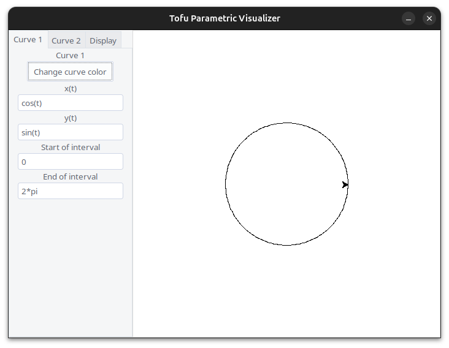
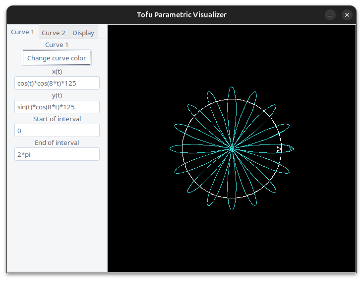

# Tofu Parametric Visualizer

A visualizer for parametric curves in R2.


## Run Locally

Clone the project

```bash
git clone https://github.com/letlovewin/tofuparametricvisualizer.git
```

Go to the project directory

```bash
cd tofuparametricvisualizer
```

From here you may need to install Python3, Tkinter, ttkthemes, and SymPy.

```bash
sudo apt install python3
sudo apt install python3-tk
sudo apt install python3-ttkthemes
sudo apt install python3-sympy
```

Finally,

```bash
./run.sh
```


## Usage/Examples

SymPy functions are supported, e.g., sin(t), besselj(1,t), etc.

Suppose you wanted to plot the curve C : (cos(t),sin(t)) over the interval [0,2pi]. It would look like this in the program:



The automatic scaling factor checkbox gives your curve an automatic multiplier that makes it appear larger. Not all functions work with this, as it works by finding the minimum and maximum of the functions you give and then doing some algebra on it. If your function isn't differentiable or SymPy otherwise can't find extrema over it for some reason, your drawing may not work. If that's the case, just turn off that setting and multiply it by some scalar and you should be fine.

## Screenshots



